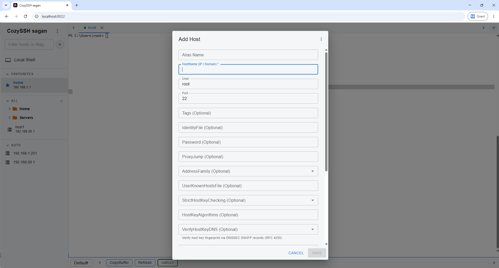
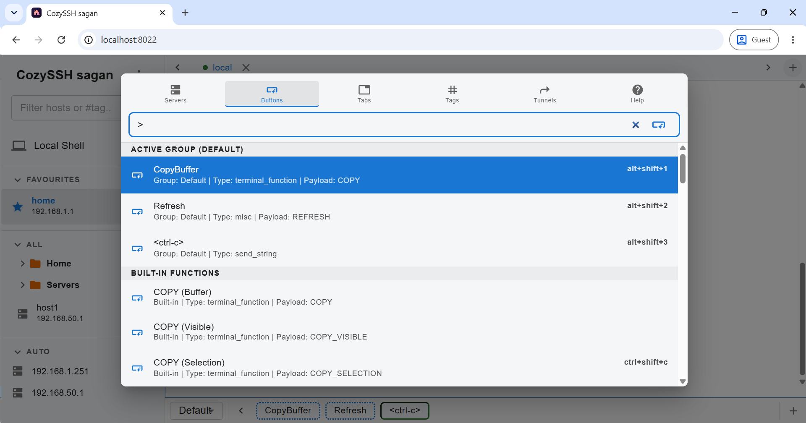
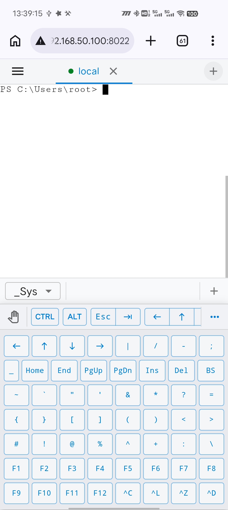

## CozySSH

CozySSH is a lightweight, mobile-friendly, full-fledged & self-hosted web-based SSH client and terminal multiplexer. It allows you to manage multiple SSH sessions and local shells from a single, modern web interface. It's intuitive and easy, ready to use out of the box, while also having advanced features and being highly configurable & extensible. It's core functions can be extened via [CozySSH Plugins][].


- [CozySSH](#cozyssh)
- [Screenshots](#screenshots)
- [Features](#features)
- [Guide](#guide)
  - [Installation](#installation)
  - [Usage](#usage)
  - [Config \& Data](#config--data)
  - [Run as systemd service](#run-as-systemd-service)
  - [OpenSSH compatibility](#openssh-compatibility)
- [Development](#development)
  - [Prerequisites](#prerequisites)
  - [Build](#build)
  - [Test](#test)
  - [Generate](#generate)
- [License](#license)

## Screenshots

<details>
<summary>Split Screen</summary>


</details>

<details>
<summary>Add Host Form</summary>



</details>

<details>
<summary>File Browser</summary>


</details>

<details>
<summary>Text Editor</summary>


</details>

<details>
<summary>New Tab Dialog <code>Alt+O</code></summary>


</details>

<details>
<summary>Command Palette <code>Alt+E / Ctrl+Shift+P</code></summary>



</details>

<details>
<summary>Mobile View</summary>


</details>

<details>
<summary>Mobile Assistant Keyboard</summary>



</details>

## Features

- **Use Host SSH Config**: It uses the host OpenSSH client config files (`~/.ssh/id_ed25519`, `~/.ssh/known_hosts`, `~/.ssh/config`) directly for ssh auth & server management.
  - It automatically displays plain text (non hashed name) servers of `~/.ssh/known_hosts`. It's recommended to disable known_hosts name hashing feature globally by modifying `/etc/ssh/ssh_config`:
    ```
    Host *
      HashKnownHosts no
    ```
- **Modern UI**: A sleek, concise, yet full-fledged UI based on React and [Material UI](https://github.com/mui/material-ui).
  - **High-contrast Light Theme**: Designed for readability.
  - **Multi-Tab Interface**: Run multiple concurrent SSH sessions and local shells in a single browser tab.
  - **Split Screen Window**: Display multiple ssh servers in single split-screen tab. View up to 4 terminal panes in a single tab.
  - **New Tab Dialog**: Powerful "New Tab Dialog" (shortcut: `Alt + O`) to quickly create new session, navigate opened tabs, or execute custom button. Inspired by Notion New Tab dialog.
  - **Button Bar**: A scrollable toolbar at the bottom of the terminal window for quickly sending string to terminal or executing custom function. Inspired by [SecureCRT Button Bar](https://www.vandyke.com/support/tips/button_bar.html).
    - **Button Types**: Button can be configured to any of the below functions.
      - **Send String**: Send custom string to current terminal. Support sending control keys via `<ctrl-x>` syntax (e.g., `<ctrl-c>` for SIGINT), which are sent with precise timing to ensure they reach the shell correctly.
      - **Built-in Functions**: Lots of pre-defined actions to control the terminal or the frontend.
      - **Open Terminal**: Open specific terminal(s), optionally with custom parameters & options.
      - **Run Script**: Run custom script to archive any desired effect. See [Scripts Documentation](docs/SCRIPTS.md).
    - **Full Shortcut Support**: Buttons support keyboard shortcut invocation.
      - **Direct Shortcut** : Built-in `alt + shift + 1-9,0` shortcut to invoke the first 10 buttons of current button group.
      - **Custom Shortcut** : Assign arbitrary custom shortcut (e.g. `ctrl+shift+m`) for any button.
    - **Autorun**: `Open Terminal` and `Run Script` button can be set to auto-run on frontend page load.
  - **Mobile-Friendly**: All features can be accessed seamlessly from mobile browser.
    - **Responsive sidebar and layout**.
    - **Mobile Input Toolbar**: Quick access to `Ctrl`, `Alt`, `Esc`, `Tab`, `Arrow keys` on mobile device. Click `...` to access more special chars from on-screen keyboard area.
    - **Keyboard-Aware Viewport**: Automatically resizes to fit your visible mobile screen perfectly even when the on-screen keyboard is active.
    - **Gesture Support** : Swipe left / right to switch tab in mobile browser.
  - **Accident-Proof Forms**: All "Add / Edit" dialogs prevent accidental closure via backdrop click if any data has been modified.
- **SFTP & Local File Management**: 📁
  - **SFTP & Local File Browser**: Browse, upload, download, filter or edit files directly from your terminal tabs.
  - **Split View**: Access the file browser via the terminal tab's context menu without losing your shell session.
  - **Text File Editor**: Edit text file of SFTP / local server directly in Browser.
- **Shell Integration**: Built-in Shell Integration features including cwd detection, cmd history, copy last command output and more. An button in File Browser to navigate to shell cwd (`$PWD`) directly. In newer Linux systems (Ubuntu 26.04+ / Debian 14+) it uses the OS scope systemd 158+ OSC 3008 sequence; For older Linux systems, it automatically injects VS Code compatible OSC 633 shell integration script into the session on connected. So everything should just works.
- **Full keyboard Shortcuts**: It supports a complete set of keyboard shortcuts.
  - Note: in Mac, by default `Command` key (JavaScript KeyboardEvent `ev.metaKey`) is recognized as `Alt` (Originally the `Option` key); and vice versa. So press `Command + O` in Mac is recognized as `Alt + O` shortcut.
  - `Alt + O` : Open new tab dialog, use `← →` (or `Alt + H/L`) to switch view, `↓ ↑` (or `Alt + J/K`) to select, `Enter` to open, `Alt + Enter` to open in current tab, `Ctrl + Enter` to open in new window, `Shift + Enter` to edit selected host, `Alt + Shift + Enter` to input selected host into filter. Use `Alt + D` to delete a recent item; `Alt + Backspace` to clear the filter. Use `Alt + ↓↑` (or `Alt + Shift + J/K`) to jump through items quickly; Hold `Ctrl` to jump to top/bottom. `Ctrl/Alt + Mouse Click` is same as `Clt/Alt/Shift + Enter`
  - `Alt + A` : Open new tab dialog - tabs view
  - `Alt + E / Ctrl + Shift + P` : Open new tab dialog - buttons view
  - `Alt + P` : Open new tab dialog - tags view
  - `Alt + :` : Open new tab dialog - tunnels view
  - `Alt + ?` : Open new tab dialog - all view
  - `Shift` holded with `Alt + O/A/E/P/:/?` : Same as `Alt + O/A/E/P/:/?` but preserve last input filter value
  - `Alt + N` : Open new default local shell tab; Hold `Ctrl` to open in current tab
  - `Alt + Shift + N` : Open new alternative local shell tab; Hold `Ctrl` to open in current tab
  - `Alt + S` : Open scratchpad
  - `Alt + H / Alt + L` : Switch to previous / next pane
  - `Alt + Shift + H / Alt + Shift + L` : Switch to previous / next tab
  - `Alt + 1-9,0` : Switch to tab 1-9, last tab
  - `Alt + C` : Clone active pane in new tab
  - `Alt + Shift + C` : Clone active pane in same tab (Max 4 panes per tab)
  - `Alt + W` : Close active pane
  - `Alt + Shift + W` : Close active tab
  - `Ctrl + Alt + Shift + W` : Close other tabs
  - `Ctrl + Alt + Shift + L` : Toggle Lock/Unlock current tab
  - `Alt + I` : Focus sidebar search filter and clear current value, then use `↑ ↓` to select, `Enter` to open (or toggle group expandness), `Alt + Enter` to open in current tab, `Ctrl + Enter` to open in new window (or toggle group and all sub-groups expandness), `Shift + Enter` to open context menu. `Ctrl/Alt + Mouse Click` is same as `Ctrl/Alt + Enter`, `Shift + Mouse Click` to edit host.
  - `Alt + Shift + I` : Focus sidebar search filter but preserve current value
  - `Ctrl + Alt + Backquote` : Toggle sidebar tags section expandness
  - `Ctrl + Alt + 1/2/3` : Toggle sidebar fav/all/auto section expandness
  - `Ctrl + Alt + G` : Toggle sidebar all groups expandness
  - `Alt + G` : Focus active terminal session
  - `Alt + Shift + G` : Focus the first pane of the active tab
  - `Alt + Q` : Open input dialog
  - `Alt + Shift + Q` : Open input dialog and preserve last form values
  - `Alt + V / Alt + Shift + V` : Switch to next / previous group in button bar. Hold `Ctrl` to include hidden groups
  - `Alt + Shift + 1-9,0` : Click the button in button bar
  - `Alt + J / Alt + K` : Scroll terminal down / up by a few lines
  - `Alt + Shift + J / Alt + Shift + K` : Scroll terminal down / up by a page
  - `Ctrl + Alt + J / Ctrl + Alt + K` : Scroll terminal to bottom / top
  - `Alt + Enter` : Toggle fullscreen of main terminal area
  - `Alt + Backquote` : Close any modal (Dialog / Menu / Popover). Similar to `Escape` but works even if terminal is in fullscreen mode
  - `Alt + Shift + Backquote` : Force close all modals. Also close all toasts.
  - `Alt + - / Alt + +` : Decrease / increase terminal font size
  - `Alt + Shift + - / Alt + Shift + +` : Decrease / increase global & terminal font size
  - `Ctrl + Alt + 0` : Reset to default global / terminal font size (14 / 15px)
  - `Ctrl + Shift + F` : Open terminal search box
  - `Ctrl + Shift + R` : Reconnect current terminal
  - `Ctrl + Shift + C` : Copy selected text in terminal
  - `Ctrl + Shift + V (Windows) / Cmd + V (Mac)` : Paste into terminal
  - `Ctrl + Alt + R` : Refresh data from backend
  - `Ctrl + Alt + Shift + R` : Force clear service worker, cache and reload
  - `Mouse Select` in terminal to copy
  - `Mouse Right Click` in terminal to paste
  - `Mouse Middle Click` on a tab to close it
  - `Alt + Mouse Click` in terminal to move cursor to mouse position
  - `Alt + Mouse Wheel` in terminal to fast scroll up / down
  - `Shift + Mouse Click` on a button in button bar to edit it; `Ctrl/Alt + Mouse Click` on a "Open Terminal" type button to open it in new window / current tab; `Ctrl + Mouse Click` on a "Send String" type button to open it in "Terminal Input" dialog, `Alt + Mouse Click` on it to copy contents to clipboard
  - `Ctrl + Mouse Click` on backdrop of modal dialog to force close it
  - `Ctrl + Shift + M`: Enter terminal mark mode (smiliar to Windows Terminal mark mode)
- **Advanced SSH Management**: 🔑
  - **ProxyJump Support**: Full support for OpenSSH standard `ProxyJump` configuration, allowing you to connect to hosts via intermediate jump servers.
  - **RemoteCommand Support**: Support ssh_config `RemoteCommand` configuration, execute a custom command on the remote ssh server after successfully connecting to it.
  - **Tunnels Support** : Support ssh_config `LocalForward`, `RemoteForward` & `DynamicForward` tunnels configuration.
  - **Tagging System**: Organize your hosts using `### #tag` comments in your `~/.ssh/config`. Tags are fully filterable in the sidebar.
  - **Grouping System**: It uses special `g-foo/bar` syntax tag to organize hosts by nestable groups. The sidebar display grouped servers in tree view.
- **Local Shells**: Open local shell tab. It automatically discovers and displays list of local system installed / available shells.
- **Terminal UX Enhancements**:
  - **Heartbeat & Keep-Alive**: Automatic SSH session background heartbeat (`keepalive@openssh.com`) every 30 seconds ensures stable connections and prevents idle timeouts.
  - **Manual Reconnection**: If a terminal session is lost or "stolen" by another browser instance, simply press **Enter** to instantly reconnect.
  - **Auto-copy**: Selected text is automatically copied to your clipboard.
  - **Right-click Paste**: Quickly paste clipboard contents into any active terminal session.
  - **Selection Highlighting**: Clear visual feedback for selected text.
  - **Interactive Verification**: Full support for interactive Host Key verification and Keyboard-Interactive (Password) authentication.
  - **Smart Resize logic**: Optimized terminal resizing that preserves shell prompt integrity when switching between multiple active tabs.
  - **Tab Pinning & Persistence**:
    - **Persistent Sessions**: Right-click any tab and select **"Pin Tab"** to keep the terminal session (PTY or SSH) running in the background even if you close your browser or navigate away.
    - **Output Buffering**: Pinned sessions maintain a circular output buffer (approx. 50KB), ensuring you see the most recent activity immediately upon reconnection.
    - **Usage-Aware Auto-Restore**: Pinned tabs automatically resume when you re-open CozySSH, but only in the primary window to prevent duplicate UI clutter.
    - **Lock Tab**: Tabs can be locked, which works similar to pinning but also prevent accidental closing.
- **Scratchpad feature**: Open a "Scratchpad" text editor tab to write your notes or paste some configuration commands or other text. All data is auto-saving and cached in browser localStorage and automatically synced with and persisted in backend.
- **Secure by Default**:
  - **Stateless Authentication**: HMAC-SHA256 token-based authentication with a simple App Password.
  - **Non-Local Restriction**: Automatically blocks access from non-local, non-HTTPS environments to prevent credential sniffing.
  - **Password Management**: Reset your application password anytime via the CLI using the `-do-reset-password` flag.
- **Custom Scripting**: Fully programmable / extendable via a built-in powerful & TypeScript-capable scripting engine. See [Scripts Documentation](docs/SCRIPTS.md). It also has a [Plugins Repository][CozySSH Plugins] which includes many official scripts/plugins that can be installed directly from CozySSH frontend.
- **Self-Hosted & Easy to deploy**: Distributed as a single Go binary that embeds the entire React frontend.

## Guide

### Installation

Download from GitHub Releases and put `cozyssh` binary to any location.

### Usage

Run the CozySSH binary:

```bash
./cozyssh
```

On first run, CozySSH will generate a default configuration file at `~/.config/cozyssh/config.json` with an initial random **App Password**. Check the terminal output to find the initial password. The app password can be changed in UI. If you forget your app password, you can reset it to a new random value by running `cozyssh -do-reset-password`.

CozySSH listens on `127.0.0.1:8022` by default. By default, CozySSH can only be accessed from `localhost` hostname (e.g. http://localhost:8022 ) or from a `https` origin by running CozySSH behind a TLS enabled reverse proxy (like [Traefik](https://github.com/traefik/traefik) or Nginx) and / or CDN provider (like Cloudflare). Start cozyssh with `-allow-insecure-http` flag to lift the restriction.

<details>

<summary>Example Traefik config to run as a reverse proxy for CozySSH (toml)</summary>

```toml
[core]
  defaultRuleSyntax = "v2"

[entryPoints.websecure]
  address = ":443"

[[tls.certificates]]
  certFile = "/certs/example.com.pem"
  keyFile = "/certs/example.com.key"

[http.routers.cozyssh]
rule = "Host(`cozyssh.example.com`)&&PathPrefix(`/`)"
service = "cozyssh"

[http]
  [http.services]
    [http.services.cozyssh]
      [http.services.cozyssh.loadBalancer]
        [[http.services.cozyssh.loadBalancer.servers]]
          url = "http://127.0.0.1:8022/"
```

</details>

### Config & Data

CozySSH stores its settings in `~/.config/cozyssh/config.json`. The default `~/.config/cozyssh` path can be changed by running CozySSH with `-config <dir>` command line flag. CozySSH stores all app data (excluding OpenSSH data) here. See [docs/DATA.md](./docs/DATA.md) for more details.

### Run as systemd service

You can run CozySSH as a systemd service.

<details>
<summary>Example <code>cozyssh.service</code> systemd service file:</summary>

```
# Put this file to `/etc/systemd/system/cozyssh.service`
# Put `cozyssh` binary to `/usr/bin/cozyssh`
# Run `systemctl enable --now cozyssh` to enable & start the service

[Unit]
Description=cozyssh

[Service]
Type=exec
User=root
WorkingDirectory=/root
ExecStart=/usr/bin/cozyssh
Restart=always

[Install]
WantedBy=multi-user.target
```

</details>

### OpenSSH compatibility

CozySSH aims to behavior the same way as standard OpenSSH client. But it still has lots of quirks:

- `Host *` pattern or any other pattern which includes special chars (like `*`, `!`) is ignored.
- Only `~/.ssh/config` config file is used. CozySSH doesn't read `/etc/ssh/ssh_config`, nor does it read `Include *.conf` directive introduced sub-config files.
- Only one identity file is supported for each host. If host `IdentityFile` is not set, CozySSH use `~/.ssh/id_ed25519` (if exists) of `~/.ssh/id_rsa` automatically.
- SSH Agent protocol and relative directives are not supported at this time.
- ssh_config directives `TOKENS` expansion is limited, only basic tokens are supported.
- Only `RemoteCommand` but not`LocalCommand` is suuported.
- Only `ProxyJump` but not `ProxyCommand` is supported at this time.

## Development

### Prerequisites

- [Go](https://golang.org/doc/install) 1.25+ (for building the backend)
- [Node.js v24 & npm](https://nodejs.org/en/download/) (for building the frontend)

Older versions of Go or Node.js may also work but I didn't test them.

### Build

```bash
# Build the frontend
npm --prefix frontend install
npm --prefix frontend run build

# Build the Go binary
go build
```

### Test

See [docs/TEST.md](docs/TEST.md).

### Generate

Some files are generated by scripts.

- `frontend/csapi.d.ts` : The custom scripting API TypeScript definitions. It's used by [CozySSH Plugins][]. CozySSH itself doesn't use this file. Generated by `npm --prefix frontend run gen-csapi`.
- `frontend/src/api.ts` : The Go backend API TypeScript definitions. The frontend uses this file. Generated by `go run github.com/tkrajina/typescriptify-golang-structs/tscriptify@latest -interface -package=cozyssh/models -target="frontend/src/api.ts" models/models.go`.

## License

BSD 3-Clause License - See the [LICENSE](LICENSE) file for details.

[CozySSH Plugins]: https://github.com/sagan/cozyssh-plugins
